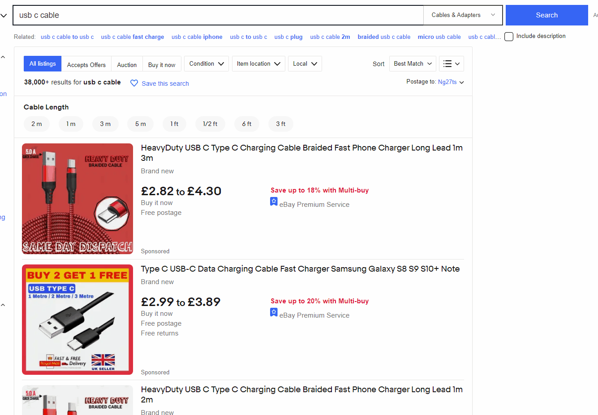
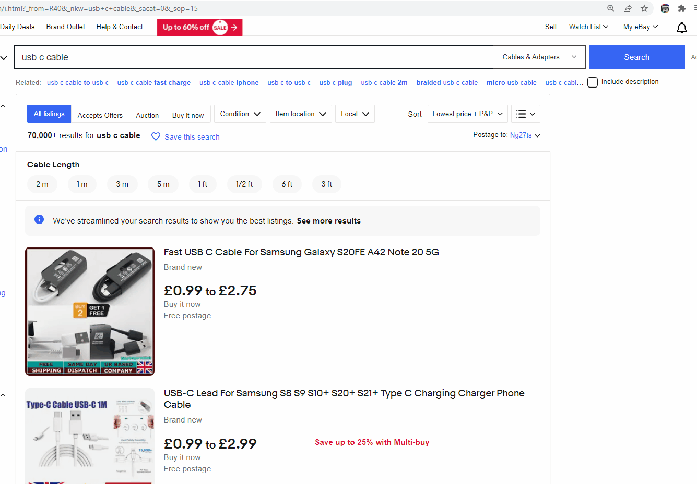

[](https://codecov.io/gh/timothy-ch-cheung/better-bay-extension)

## Getting Started

Run the development server:

```bash
npm run dev
```

## Making production build
```bash
npm run build
```

## Features
When browsing eBay and sorting items by price low-high, we often get inaccurate results due to adding a cheaper item in the listing to rank higher in the sort. For example: 

The lowest priced item on the usb c cable listing is £0.99 but the actual item that it corresponds to is a sim ejector pin.

Better Bay Extension adds tooltips to pre-fetch that information to save you from clicking into the listing:


You can also enable beta features to filter out potentially misleading listings:

